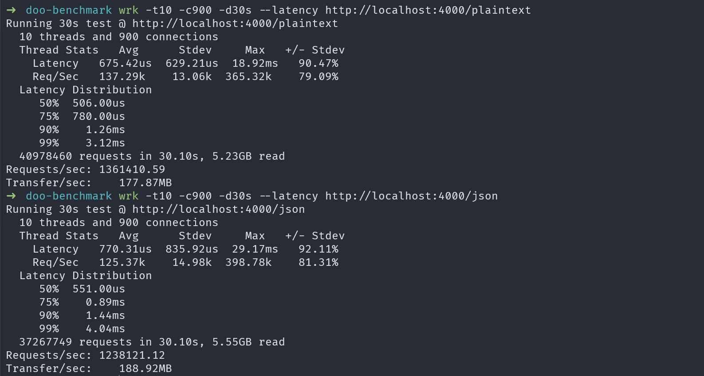

# Doo Benchmark

This is a benchmark project for [Doolang](https://github.com/nynrathod/doolang).

## Prerequisites

Make sure **Doolang** is installed before running this benchmark. Follow the installation steps from the official repository:

📖 [Installation Guide](https://github.com/nynrathod/doolang?tab=readme-ov-file#-installation)

## Running the Benchmark

### 1. Build the project

```bash
doo build
```

This will compile the Doolang code and generate the binary in the `output` folder.

### 2. Run the built binary

```bash
./output.exe
```

Execute the compiled binary to start the server on `http://localhost:4000`.

> **Note:** It is recommended to run the benchmark on a Linux system for optimal results.

### 3. Run benchmarks

In a separate terminal, use `wrk` to run the benchmarks:

#### Plaintext Benchmark
```bash
wrk -t10 -c900 -d30s --latency http://localhost:4000/plaintext
```

#### JSON Benchmark
```bash
wrk -t10 -c900 -d30s --latency http://localhost:4000/json
```

### Example Benchmark Results




## Benchmark Configuration

- **Threads (-t)**: 10
- **Connections (-c)**: 900
- **Duration (-d)**: 30 seconds
- **Latency**: Enabled


## Notes

> **Local Machine Benchmark**
> These results were measured on a local development machine using a release build compiled with LLVM optimizations.
> Results will vary based on CPU, memory, OS, and available system resources.
> Linux is recommended for best performance. Windows results may differ due to syscall overhead.